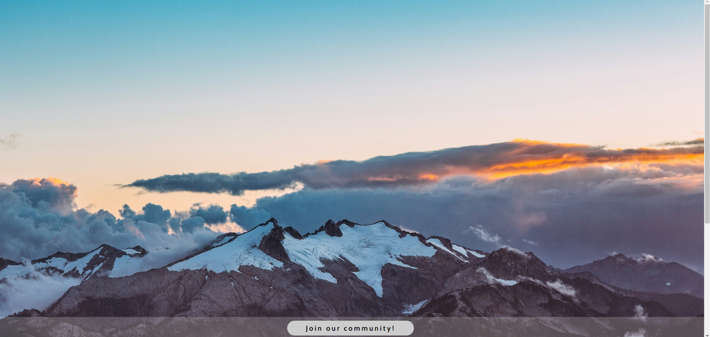

# Project: Sign-up Form

## Overview

This project offers a hands-on opportunity to build a mock-up sign-up form. Using JavaScript for form validation, HTML for structuring the form, and intermediate CSS techniques like CSS units, positioning, and advanced selectors, you'll create a functional sign-up experience. The form will include basic validations for required fields, catering to hikers seeking a community for their hiking adventures.

Come and check my design [here](https://krig6.github.io/odin-sign-up-form/)!

## Sample

## Technologies Used

- HTML: Provides the structure and layout of the web page.
- CSS: Styles the overall interface with animations.
- JavaScript: Implements form validation for required input fields.

## Features

- Basic Animations: Transform animations for opening and closing the modal.
- Input Field Validations: Validations for required input fields with border color change for valid or invalid inputs.
- Real-time Feedback: Provide real-time feedback to users as they fill out the form, such as displaying error messages.
- Custom Error Messages: Provide more descriptive error messages for input validation, guiding users on what needs to be corrected.

## Learning Path

This project I found on the Odin Project gave me a starting point to work from, but I wanted to make it my own. Even though I knew some HTML, CSS, and JavaScript basics, this project threw me some new challenges. Making sure the design looked good and adding animations all took some figuring out.

The toughest part for me was making sure that when someone filled out the form, it would check if they entered the right information. I had to use something called regex, which was confusing. Plus, I had trouble figuring out how to let users know if they got something wrong just by looking at the form.

But, even with all the challenges, seeing the project come together and actually work was super satisfying. It's these little wins that show me how much I'm learning as I go along on my coding journey.

## Future Enhancements

- Ability to switch from sign-up to login
- More efficient and accurate way of validation
- Server-side validations
- A complete webpage providing support for hikers to find a community
- Responsive design for all devices

## Acknowledgments

- Photo by [Nitish Meena](https://unsplash.com/@nitishm) on [Unsplash](https://unsplash.com/) 
- Photo by [Jaime Reimer](https://www.pexels.com/@jaime-reimer-1376930/) on [Pexels](https://www.pexels.com/)
